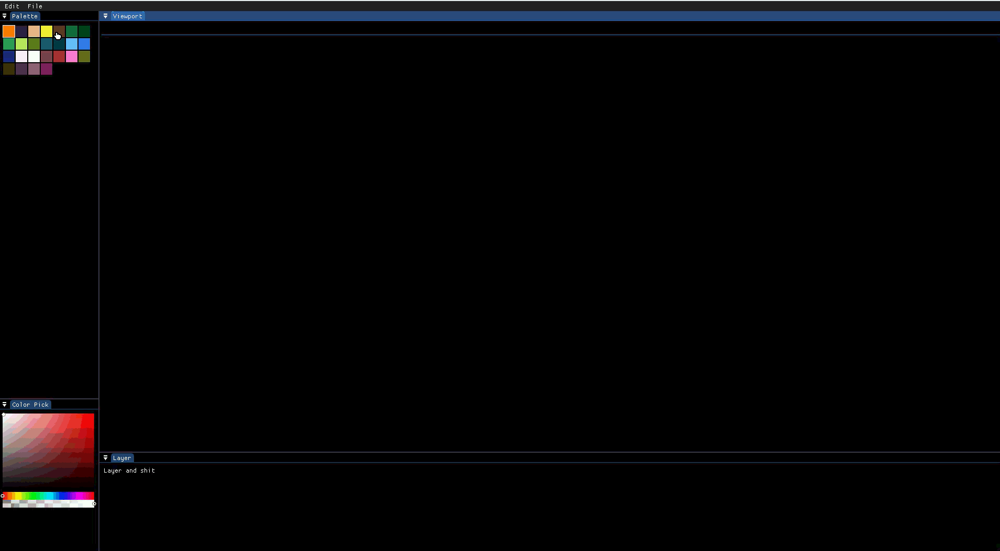
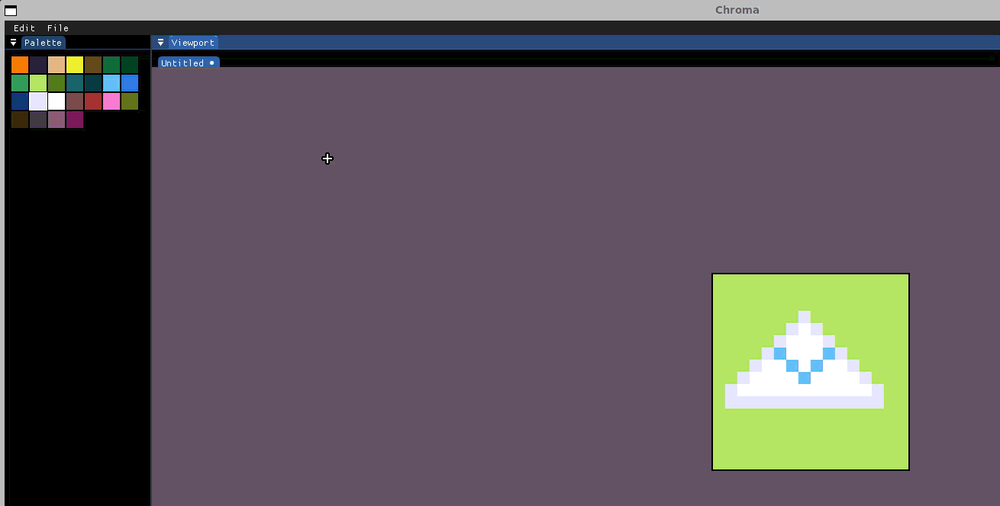
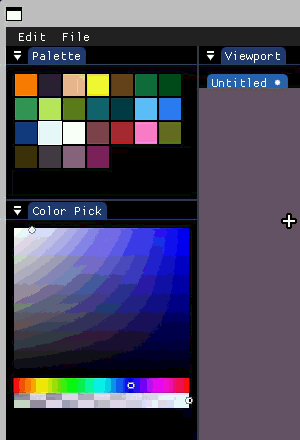

# Chroma

Chroma is a Linux raster graphics editor developed in C++ inspired by Gimp and influenced by Aseprite software.


## Overview

Chroma aim to provide an easy-to-use and ready-to-go with most useful features for casual graphical editing.

- Light image editing
- Easy to use
- Ready to go

## Quick start

### Prerequisities

[Download Cmake here](https://cmake.org/)

[SDL dependencies](https://github.com/libsdl-org/SDL/blob/main/docs/README-linux.md)

[GCC](https://github.com/libsdl-org/SDL/blob/main/docs/README-linux.md)

### Installation

- Clone the repository and pull the dependencies using ```git clone --recursive <url>```

- If you cloned only using ```git clone <url>``` :

    Once cloned, pull dependencies yourself using ```git submodule update --init --recursive```

Build the project:

```bash
cmake -B build
```

Once done, use the following command to launch the project:

```bash
cmake --build build && ./build/chroma
```

## Basic Controls

`Left Click`: Draw with current color.

`Right Click`: Over the colorpicker, register new color in palette

`Scroll`: Zoom in/out.

`Mouse click`: Move canva

`B`: Brush tool

`E`: Eraser tool

`S`: Shape tool

`M`: Select tool

## Features

### Common Commands

| Functionnalities       | Description                                    |
| -----------------------|------------------------------------------------|
| `new canva`            | Create blank canva                             |
| `open file`            | Open any file from your system                 |
| `save file`            | Save edits                                     |
| `exit`                 | Close software                                 |
| `undo`                 | Reverse last action                            |
| `redo`                 | Put back deleted content                       |
| `flip horizontal`      | Flip horizontally current picture              |
| `flip verical`         | Flip vertically current picture                |
| `brush`                | Brush to draw on canva                         |
| `colorpicker`          | Colorpicker tool                               |
| `colorpicker gradient` | Colorpicker tool to pinpoint colors            |
| `save in palette`      | Register color for later usage                 |
| `select`               | Define an area of editing                      |
| `layer`                | Multiple layer for complex editing             |
| `shape`                | Create and fill a shape by defining an area    |
| `eraser`               | Remove color from canva                        |

### Visual examples

`New canva`:



`Flip image`:



`Colorpicker`:



## Project Folders Structure

```
Chroma/
├── doc/       
├── external/       
├── include/          
├── screenshots/             
└── src/         
```

## Technical Stack

| Component      | Technologies                                                                 |
| -------------- | -----------------------------------------------------------------------------|
| Language       | C++20                                                                        |
| Graphics API   | SDL3 Renderer Vulkan                                                         |
| User Interface | Dear ImGui                                                                   |
